+++
title = '2023 Wrapped'
date = 2023-12-13T07:18:46-06:00
draft = false
+++

Well, we’re all another year closer to death.

We’ve been in Oklahoma for a year now. I wouldn’t say it feels like home the same way the hot, dry desert in the Southwest does, but it’s nice nonetheless.

When I drove from Idaho to Oklahoma for the first time I started to get a bit alarmed. The drive through Wyoming and Kansas is a long time to go without seeing trees. Thankfully, Oklahoma has trees. Mountains or hills may be a no-go, but at least there are trees - and cousins.

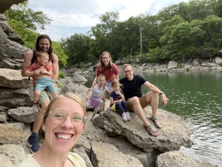
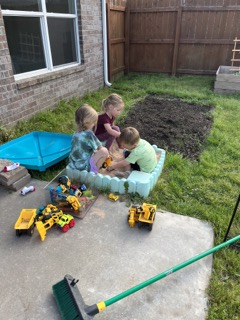 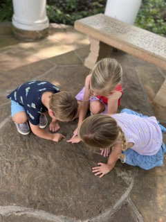 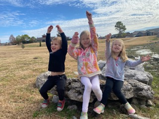

I’ll always remember arriving in Tulsa with some trepidation, knowing it was too late to turn back now; all our belongings were being trucked across New Mexico. The Tulsa area gave off good vibes, as if telling us everything was going to be ok.

We arrived in December and immediately had our work cut out for us. First of all, there was the Dog Piss Incident. We spent the first week not unpacking, but trying desperately to stop the aggressive smell of dog pee from attacking our nostrils. We won that battle, but a year later we still find disgusting dog hair in places like deeply embedded in the dishwasher components.

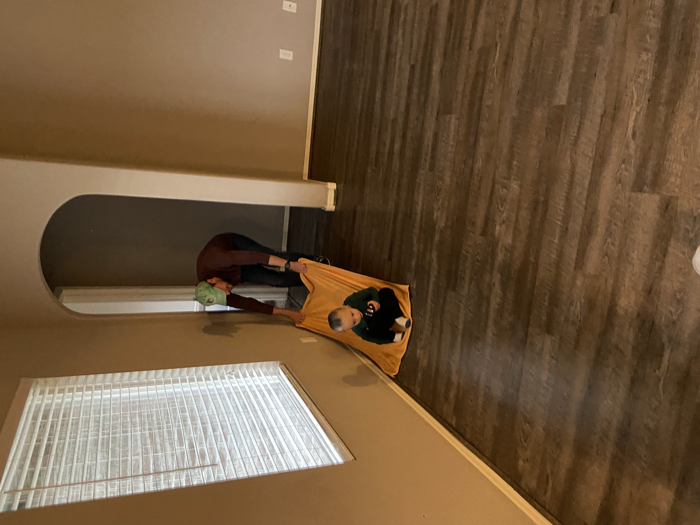

We’ve since found ourselves spending money like congresspeople for house fixes and improvements. We replaced our cheapo tin sink the builder spent as little as possible on, painted all the main rooms an actual color (unless you consider Soviet government issue gray a real color), painted the outside of the house, installed a new water heater, staved off a termite invasion (super not cheap), and reupolstered a couch. Apartment living genuinely seems appealing right about now. But the house is looking quite nice.

Sink before:

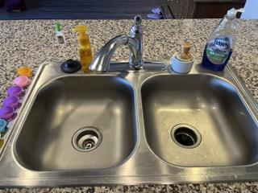

Sink after:

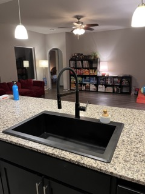

It hardly snows here. Perfect. You can shove your White Christmas up yer - fall planting! We have fall planting here, although I failed miserably at it this year. We had a garden throughout the summer and grew way too many cucumbers. Next year we’ll know more about how to take care of a garden. When there aren’t any plants, the garden bed also doubles as a construction site.

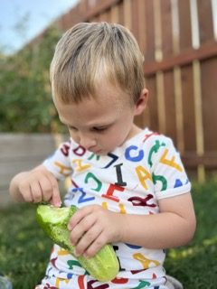
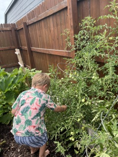

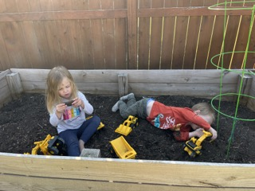

Occasionally we can venture out on a hike in the middle of winter.

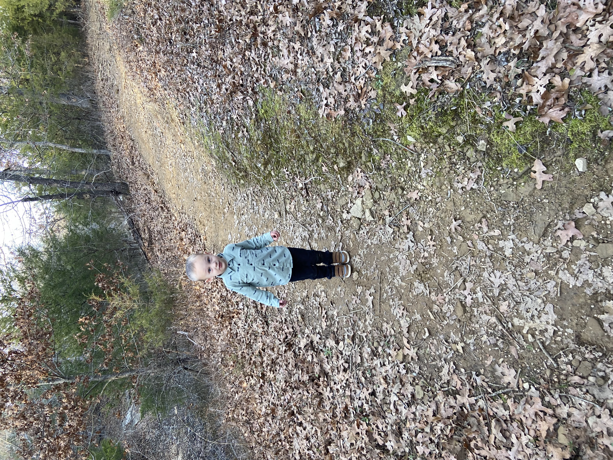

Oh, we also adopted a stray kitty. We named her Stevie. We probably should have named her Ziggy so that we could get another cat named Iggy. Hindsight, amirite?

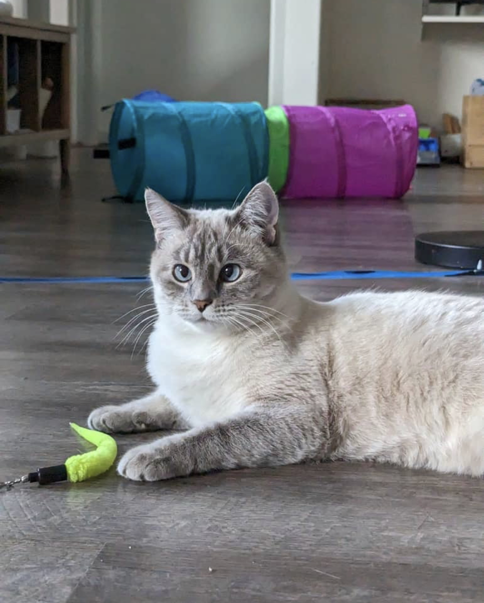 

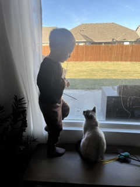 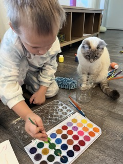

## Travel

We traveled to Arkansas and stayed in an Airbnb right next to the Ouachita River. Calvin had fun watching the boats zoom by from our balcony perch and he has asked several times since if we can go back.

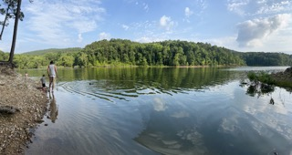

I traveled to Dallas, Kansas City, and Oklahoma City to see rad bands that I like.

The fam came to Dallas to visit Peppa Pig World which was overrun by multitudes of small excited children.

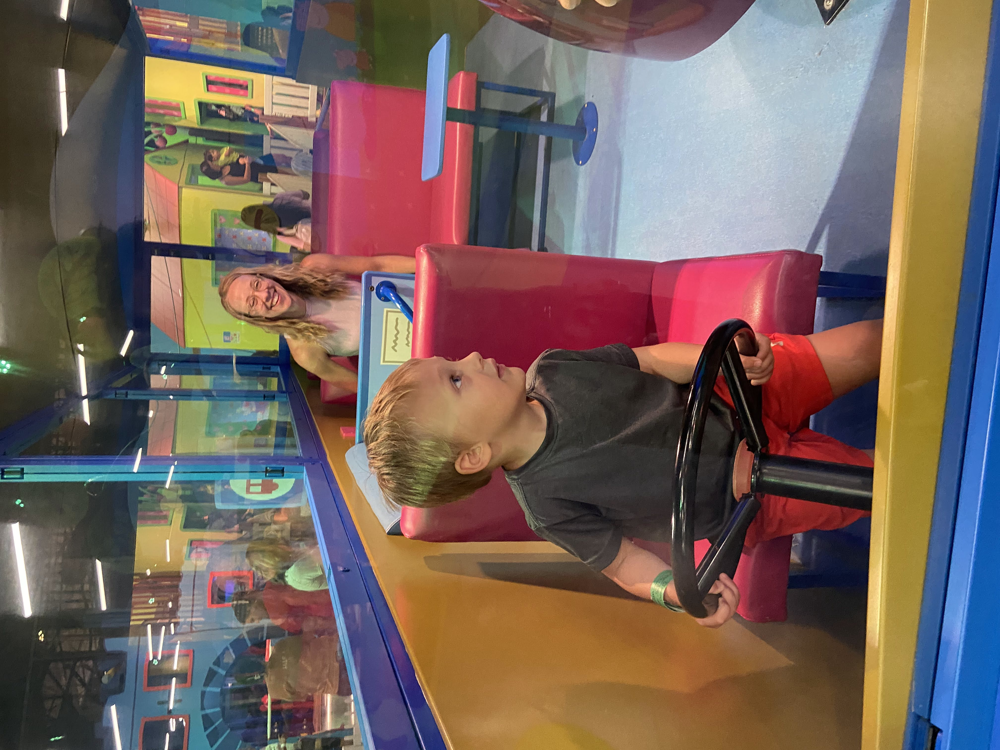
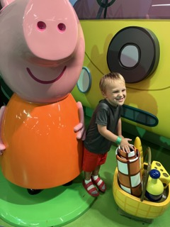

We all went to Oklahoma City together, where I had two back-to-back rock shows, to spend a couple of nights. During the day we went to some museums and the Botanical Garden which was very nice albeit smaller than expected.

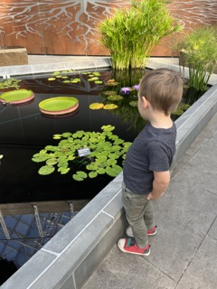

We did our normal travel to Utah and Arizona. The Utah was by airplane because the drive is too damn long with a child. I drove the 36-hour round trip to Utah by myself and got to listen to whatever the hell I felt whenever the hell I felt like it. We drove the 13 hours to Arizona. Driving long distances with a toddler can be rough indeed, but it’s a little better now that he’s older and we’re using a Rav4 instead of a massively dinky Camry. At the very least we don’t have to set up the pack-and-play in hotel rooms.

We would like to travel more. Oklahoma is Basically Midwest(TM) and we can reach a lot of locations we’ve never been to before. Louisana is beckoning. Maybe we’ll go to a nude beach. Don’t doubt us.

## Calvin

The interest in anything with wheels remains as strong as ever and it’s an interest he’s retained since he was a year old. There are many variations of playing with cards including playing mechanic (having parents talk about what is wrong with each car), sending cars down ramps, organizing cars in a “dealership”, unwrapping cards that we wrap with tissue paper, etc, etc.

This summer we discovered the pool, which for a while was something Calvin wanted to do every day. He also attended swim lessons around the time and was becoming more comfortable in the water.

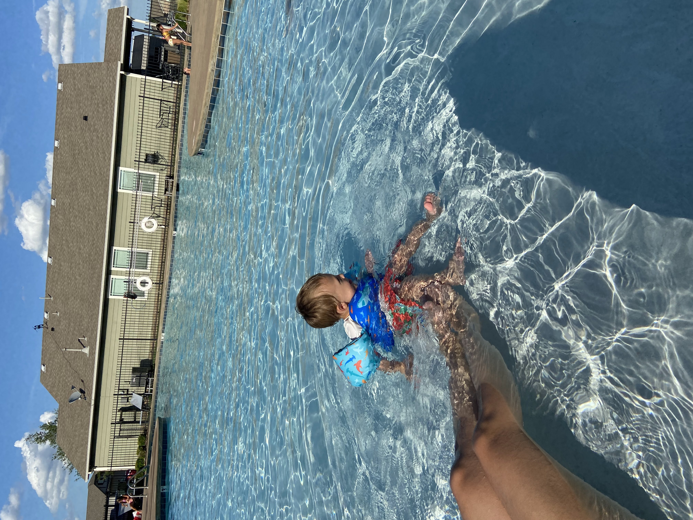

We visited the zoo several times this year. Calvin calls the animals “amazing creatures. His other favorite activity is visiting a weekly event called Wheels and Thrills which involves push cars he can ride in with mommy or daddy pushing, bouncy castles, and a multi-story high obstacle course.

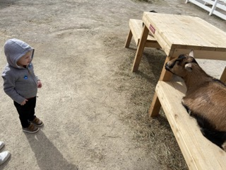

We’ve visited a lot of car shows in the first half of the year but it seems he’s grown tired of them.

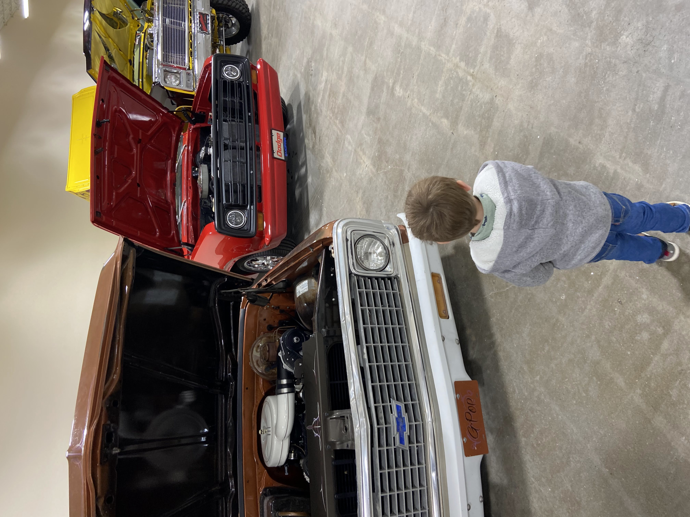

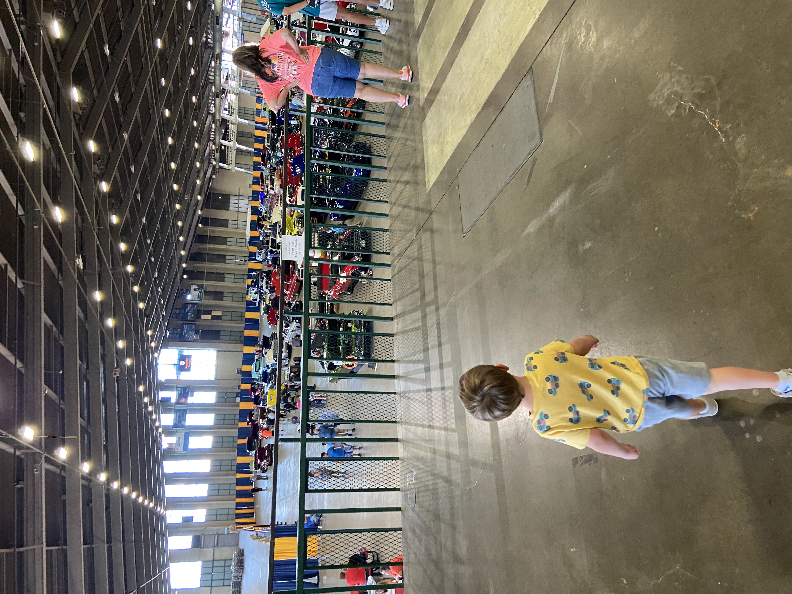

His favorite evening time activity has been to do “silly tricks” with Daddy, which means Daddy has to come up with entertaining things to do, like ghost hunting, inventing new jumps, playing games like Marco Polo, or the game of “dealership” where Calvin comes to my dealership in the backyard and tests drives a car which means running as fast as he can around the yard.

In the Fall Calvin began attending preschool at the Catholic church nearby. He attends with his cousin Karis and it seems like it’s been good for him to get more socialization. He genuinely enjoys going, it tends to be the highlight of his week.

Emily and I love Calvin very much. He’s such a pure, adorable, sweet soul.

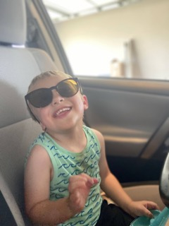

## Dallin

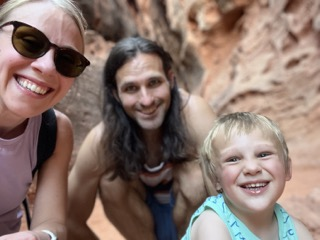 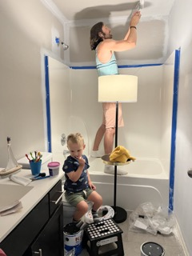

The parenting lifestyle is one of maximum chaos and minimal control or freedom, and it really kinda blows. Me and the lifestyle don’t get along For the previous three years hardly a week went by that I didn’t have some moment, or an entire day, where I wished I didn’t exist anymore. I’ve talked to some professionals who have helped a bit. The thing that actually helped break me out of the permafunk were psychedelic mushrooms. I had three big trips, the first of which I detail [here](https://family.dallincoons.com/if-i-went-on-a-mushroom-trip/) and [here](https://family.dallincoons.com/2023-19-2023-mushroom-trip-two/). These were sacred, personal, experiences that I cherish and have helped me immensely.

The mushroom trips gave me a new perspective and inspired me to start recording podcast episodes about music. They also made me stop wishing so much that I was doing something else besides the all-consuming task of parenting and be more content with my oh-so-small baby steps toward my hopes and dreams.

Parenting is as difficult as it is important, and it’s taxing emotionally, physically, physiologically, and psychologically. Every mind muscle is exhausted, and every emotion has been tested to its limit as dreams and interests have been put on hold. People do this more than once and, speaking for myself, I simply cannot understand why.

In other news, my effort to whittle down my to-read bookshelf of Actual Physical Books continues. I read 34 books in 2023, 15 of those were physical books from my shelf. That leaves 24 actual books left to read. My favorite book I read was The Right Stuff. Punished By Rewards was excellent and I recommend it highly to everyone, especially parents and teachers.

My life-line the past year and a half has been a fascinating and rewarding endeavor - to listen to 1001 albums recommended by a book called 1001 Albums You Must Hear Before You Die. I’ve listened to several hundred albums this year, most more than once. I typically try to listen to an album at least 3 times before I can feel satisified that I can judge it fairly. I’ve been pairing that with listening to an “album club” podcast which is a group of friends talking about each album, much like a book club. I’ve been compiling [a list of “best of” songs](https://open.spotify.com/playlist/0OgXg7V26cTcIhg61e8TIA?si=60d58b04f97e4fdf) from the list. Maybe I’ll call it 4,598 songs you must hear before you die.

I’ve recorded 3 podcast episodes out of my 10-episode goal, found [here](https://drive.google.com/file/d/1cdfxwrNCER6PYD0WxXdJ_dY74GprE6-M/view?usp=sharing), [here](https://drive.google.com/file/d/1xtpHoQ2h5cEEYdbxgSTlA045xg1hGPtR/view?usp=sharing), and [here](https://youtu.be/ZbvgYKPqpgU). Maybe I can get the next 7 recorded next year, gods willing.

I got my ear pierced which I've wanted to do for a long time and now that I can do whatever the hell I want I'm going to do whatever the hell I want. I'm already considering another piercing. Maybe a tattoo.

## Emily

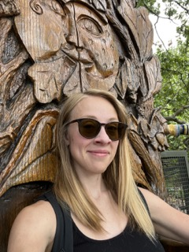

For the time being, we’re stuck in the 1950’s gender norms (man goes to work, wife is a housekeeper). Thanks, high-demand religion! Emily likes parenting overall and it’s nice to do other things sometimes. She’s always been interested in dance and has been attending classes. Unfortunately, she hurt her knee while helping move our couch out of a van so it could be reupholstered. That put a kibosh on the dance thing for a while, which totally sucks. She’s now attending physical therapy and there’s light at the end of the tunnel, but there’s no knowing how long the tunnel is.

Emily has been experimenting with taking microdoses of mushrooms (that I grew) with interesting results. Proper microdosing means that the effects are sub-perceptible - you shouldn’t be able to tell much difference at least short term. Emily has been diligent in tracking emotions in non-microdosing periods and microdosing periods and so far the results show a marked improvement in mood.

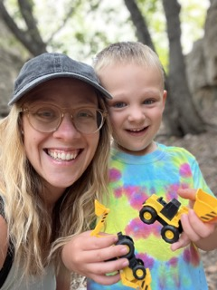

Emily is currently trying to figure out what life looks like if she has roles outside of parent/homemaker*.* Unnamed high-demand religion put her on the path of not having an identity outside of parenting and now she’s deciding where the next path leads.

Emily has been responsible for much of the house improvements over the past year. I’m going to brag a bit: The curtains, colors, and furniture additions have all been home runs. In case you didn’t know, house stuff is one of Emily’s passions. If you need any advice about what color to paint your room what to hang up on your wall or what couch to get, you know who to talk to. Please do take her advice, she’s good at this stuff.

Here's the progress pics with bad lighting. 

Before:

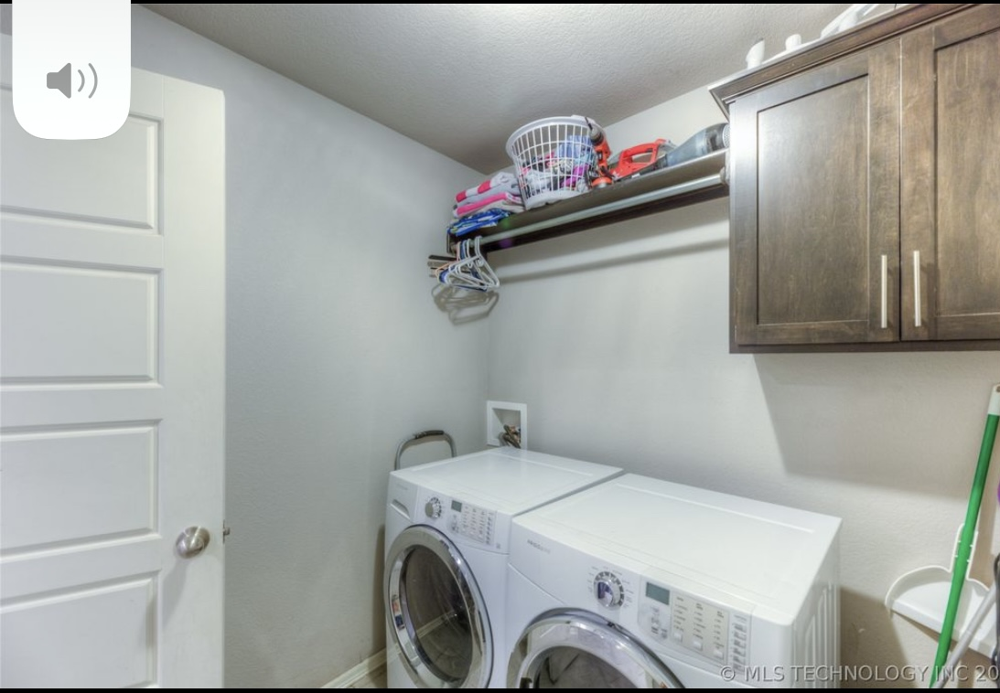 

After:

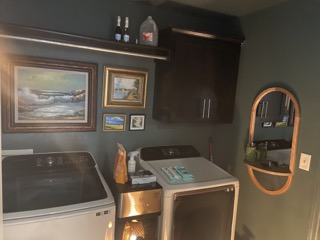

Before:

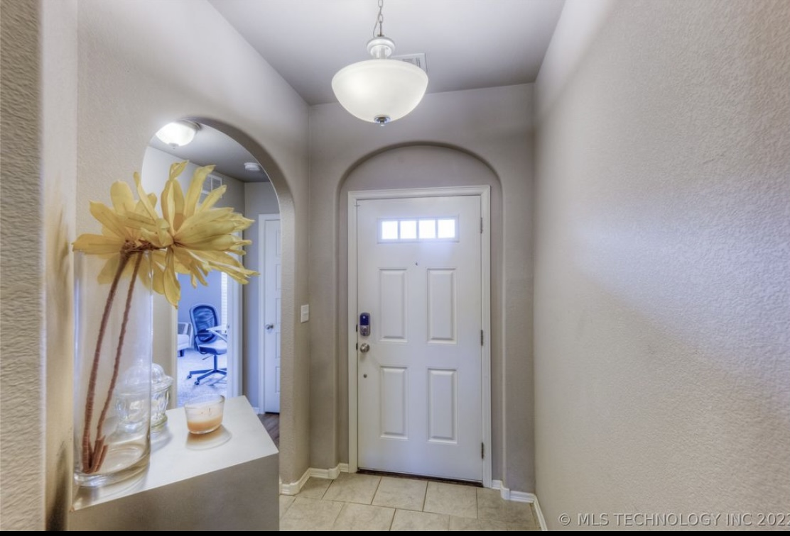

After:

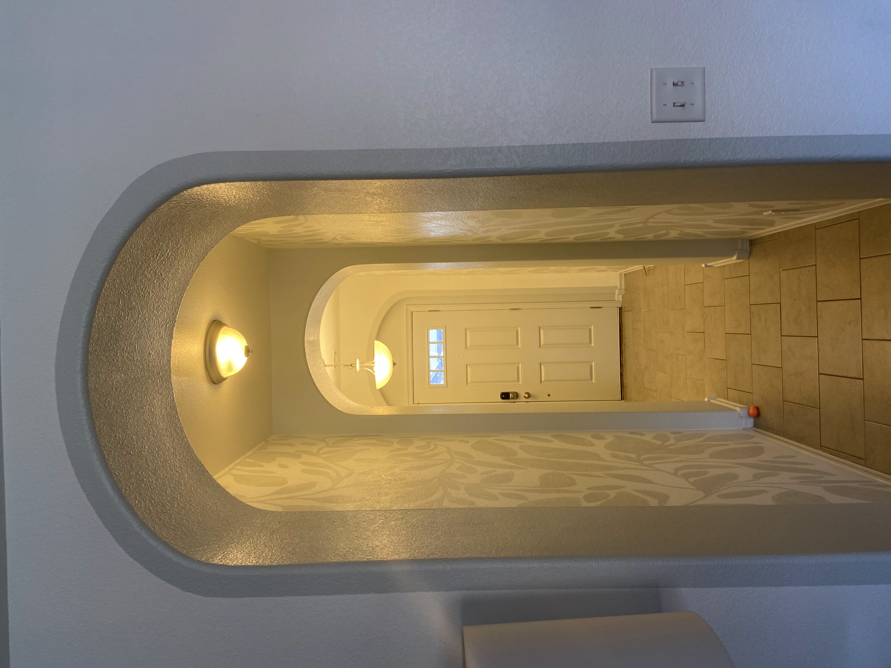 

Before:

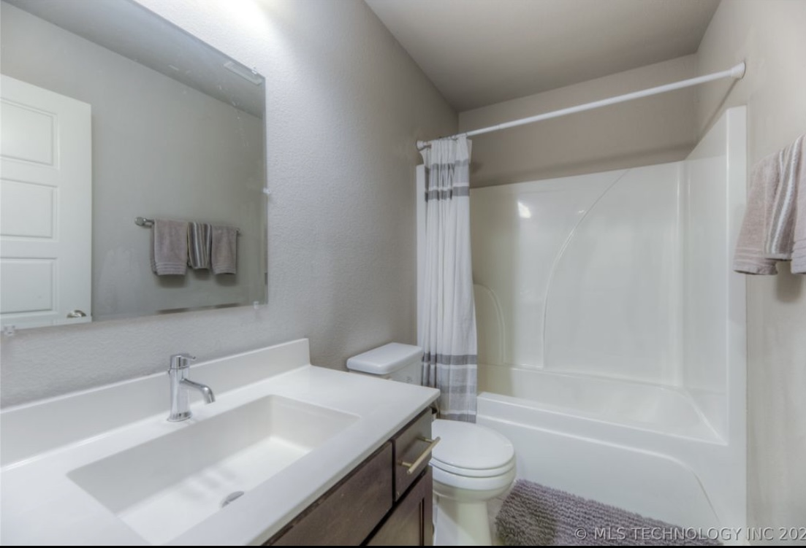

After:

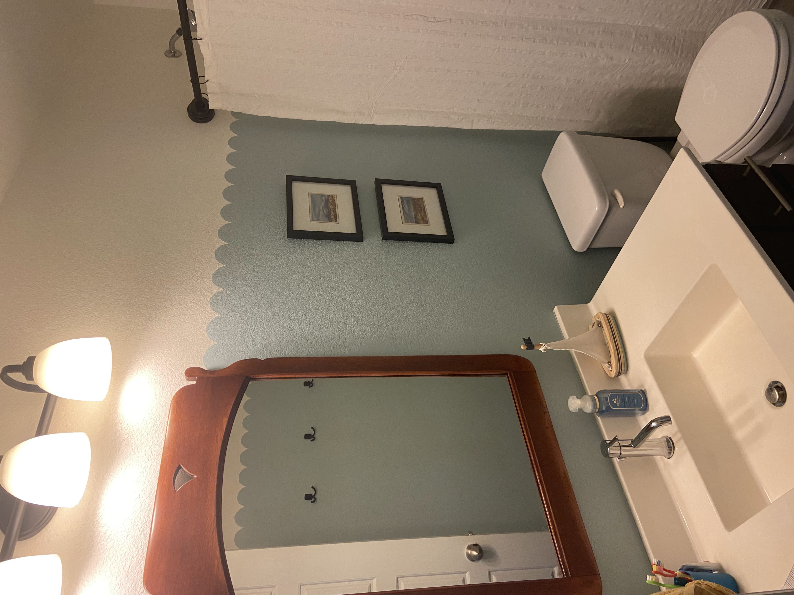

Emily is considering a tattoo and has been playing with placements using fake tattoos. Stay tuned.

## Conclusion

There's no conclusion. I think it would be cool if I wrote more next year though.

