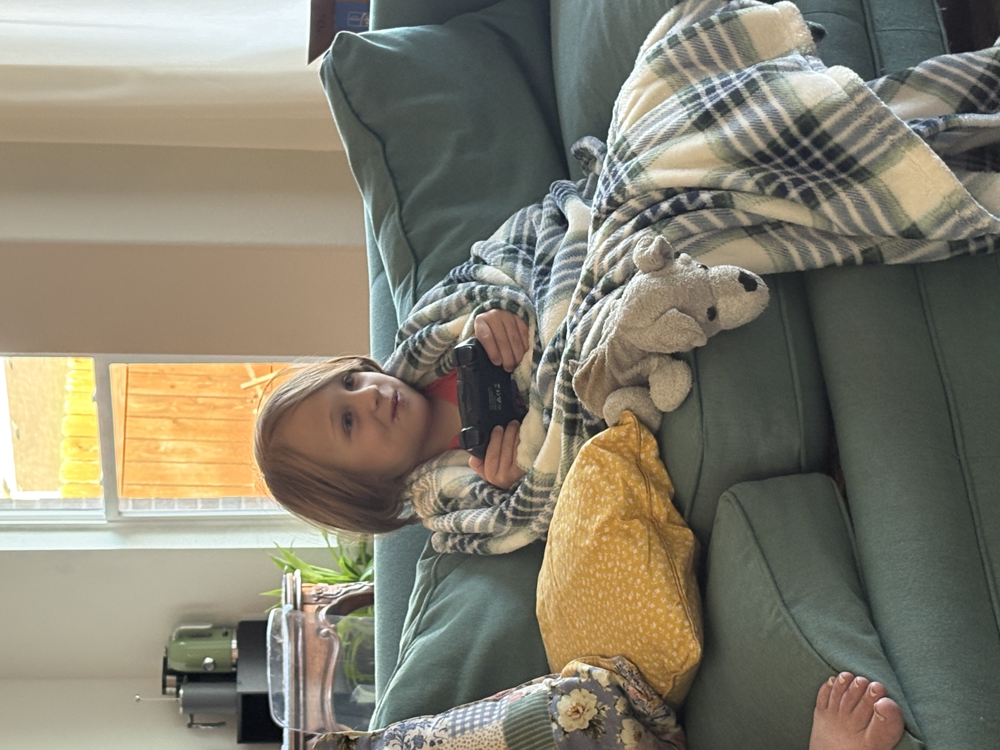
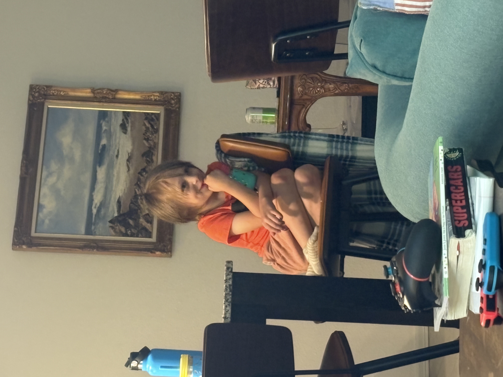
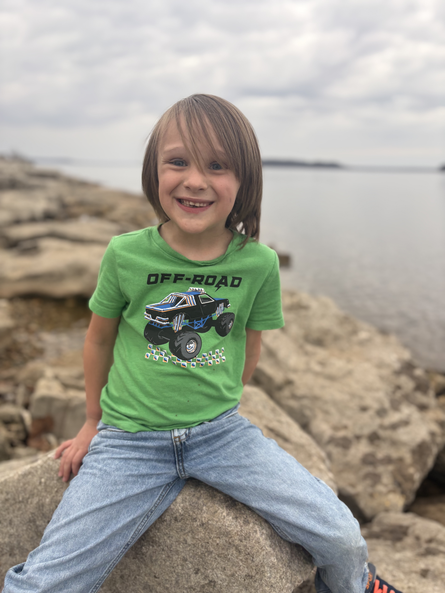
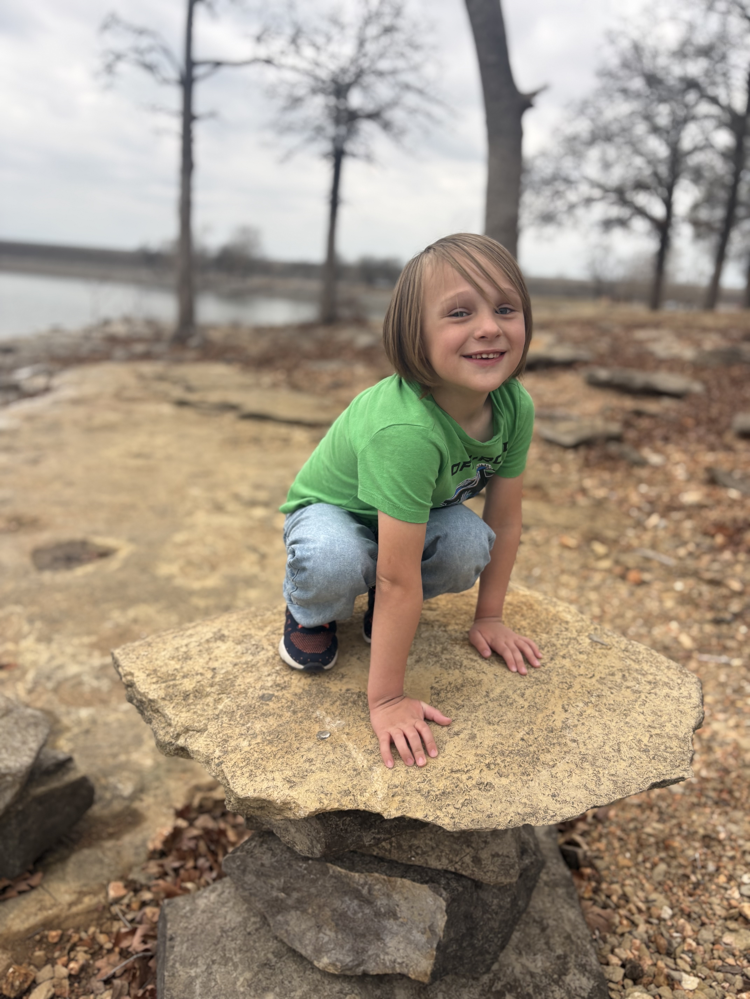
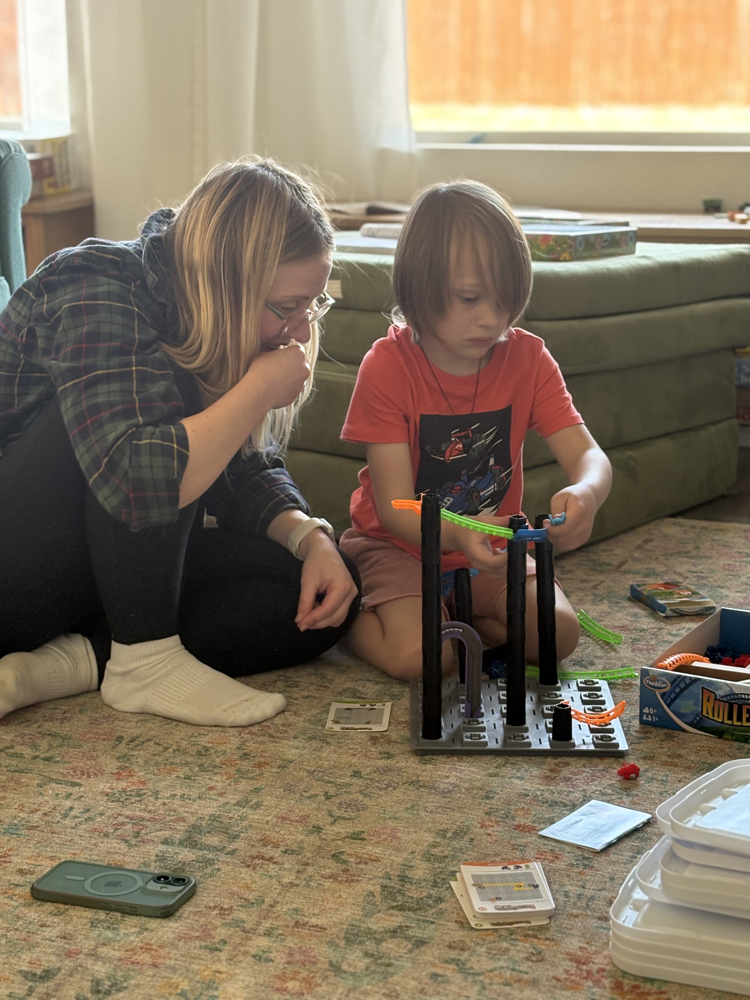
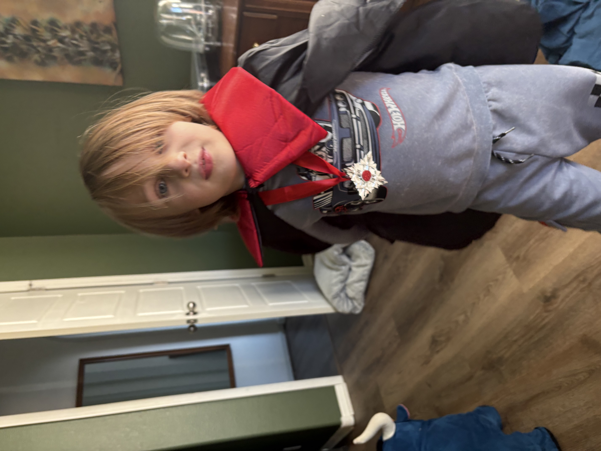
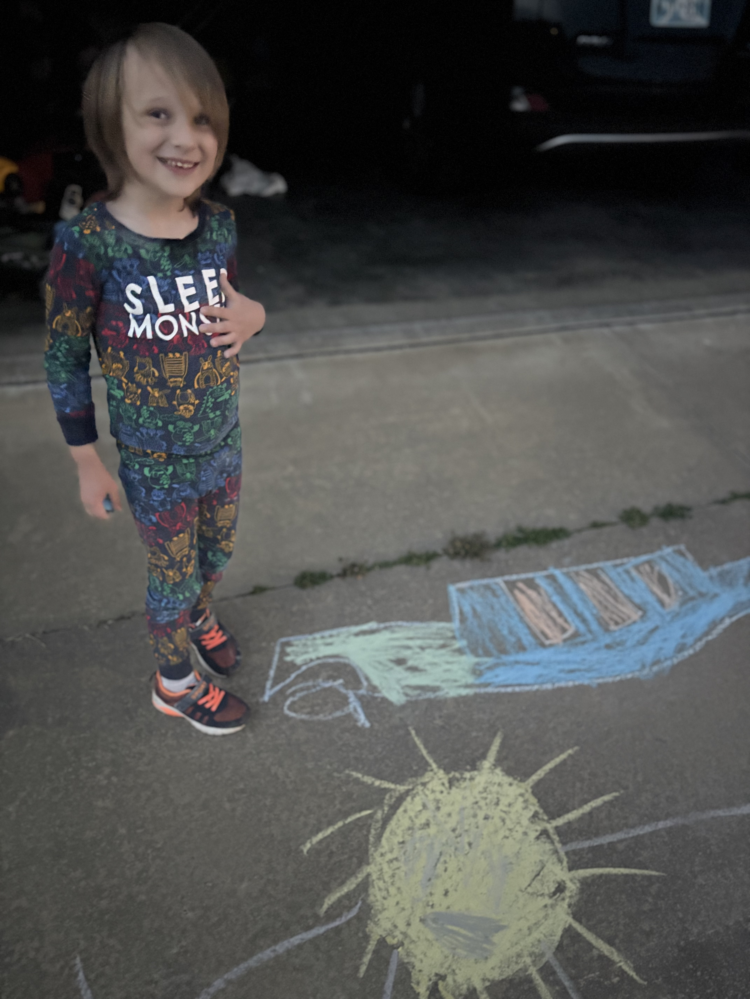
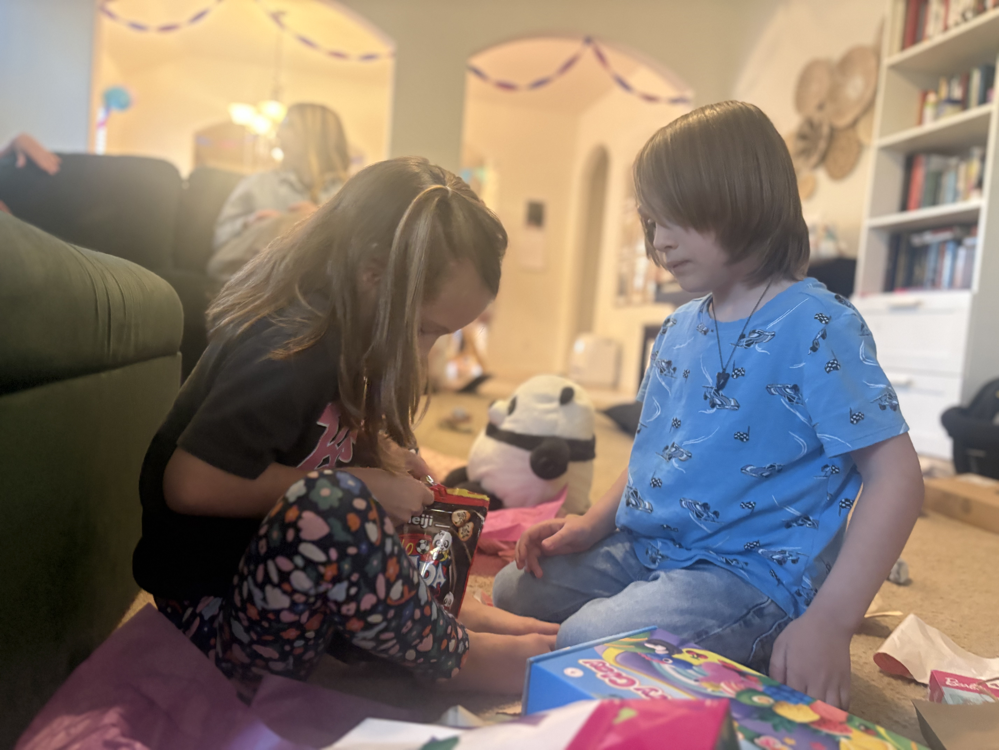
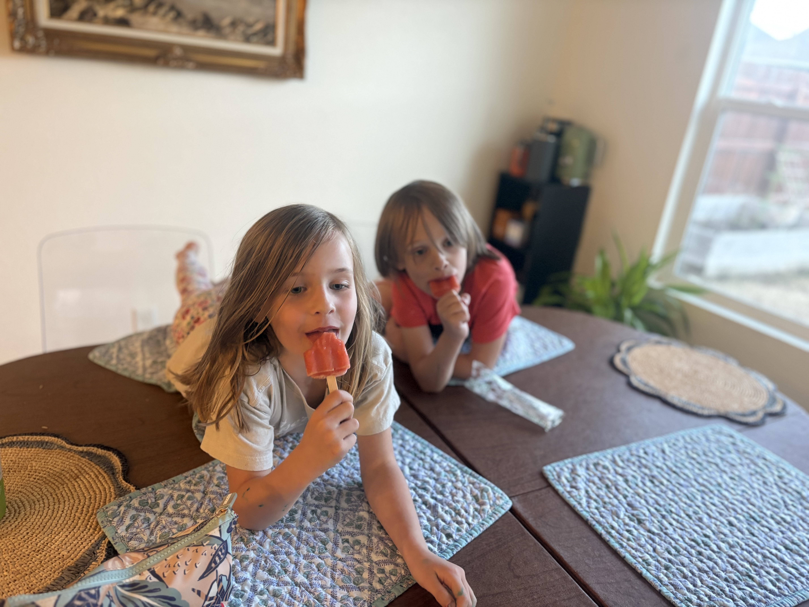
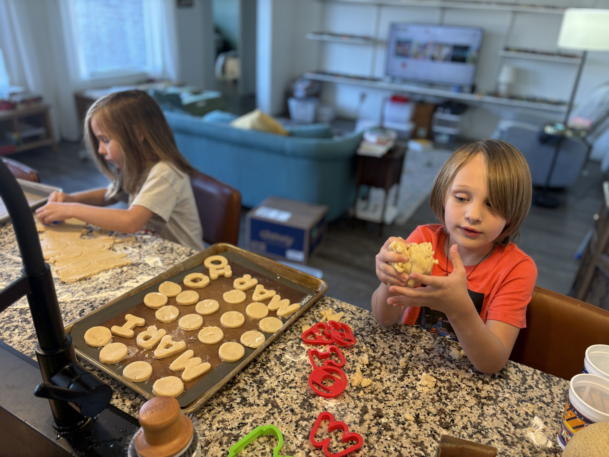

We've recently put our house on the market, mainly because we live too far away from family.

My heart has been heavy, much more so than during moves of the past. The decision has vastly more weight this time around. I'm sure a lot of it has to do with the memories I have here, and how much growing up Calvin has done in this house.

In the past few years we've developed our favorite spots and it's difficult to up and leave everything that now feels familiar. 

Part of our routine for a while has been riding our bikes on this sidewalk at least once a week, sometimes more. The destination is a park with a playground that borders a meadow, which we've done a fair amount of exploring and "offroading" in.

This may be the last time we get to do something like this, but Emily set up another Leprachaun trap for St Patricks day. Of course the Leprachauns escaped but left a mischiveous little note, some beard hair that got caught in the trap, and some treats.

The Mario Kart interest continues. We've had to set a limit on the number of races he can do in a day. It's been a family activity since we all like to play. At first he was just happy to be there driving his car, but as he's gotten much better at the game he's also gotten competive and seems to be convinced he needs to be the best player in the house. It's especially unpleasant if he's hungry (read: cranky). We've been trying to address the sore losing as it comes up and hopefully we're making progress and teaching some life skills. 

We watched the Mario movie, where they have a scene that's essentially Mario Kart racing. I managed to catch Calvin's look of delight.

When we first played the "cars get broken" game, it was him watching me crash cars. Eventually he learned how to use the keyboard to press the 'up' key to drive cars down the dragstrip to their eventual demise at the end. Now he's doing some pretty sophisticated driving over rough terrain. 

Calvin asked us one day if we could go on a hike, and we made it happen even though it was a school night. There wasn't many options since a lot of trails were still closed for the winter, but we visited Oologah Lake and threw rocks in the water. We found a rock that looked like a toilet seat, which was a big hit with this 6 year who has never met a poop joke that doesn't fill him with indescribable joy.

And this is Calvin the frog.

Aside from Mario Kart, there's still been lots of board game playing, which is a good winter activity.

Shauni got him a roller coaster builder and he's had a lot of fun with that, and maybe continuing to stoke a budding engineering interest.

One day while we were playing, Calvin suddenly disappeared and came back with his vampire costume, sunglasses and his bull, with a plan to ride it to go solve mysteries. Oh, and it also flies. I'm glad we got some pictures.

We had a sudden heat wave which gave us the opportunity to play some water games. 

Calvin used to not be particularly interested in drawing or coloring, but lately that's been something that he seems to be enjoying.  

Calvin and Karis have been growing up together, and it will be a sad day when they're no longer living in the same neighborhood and going to the same school. 

Ok, bye.

