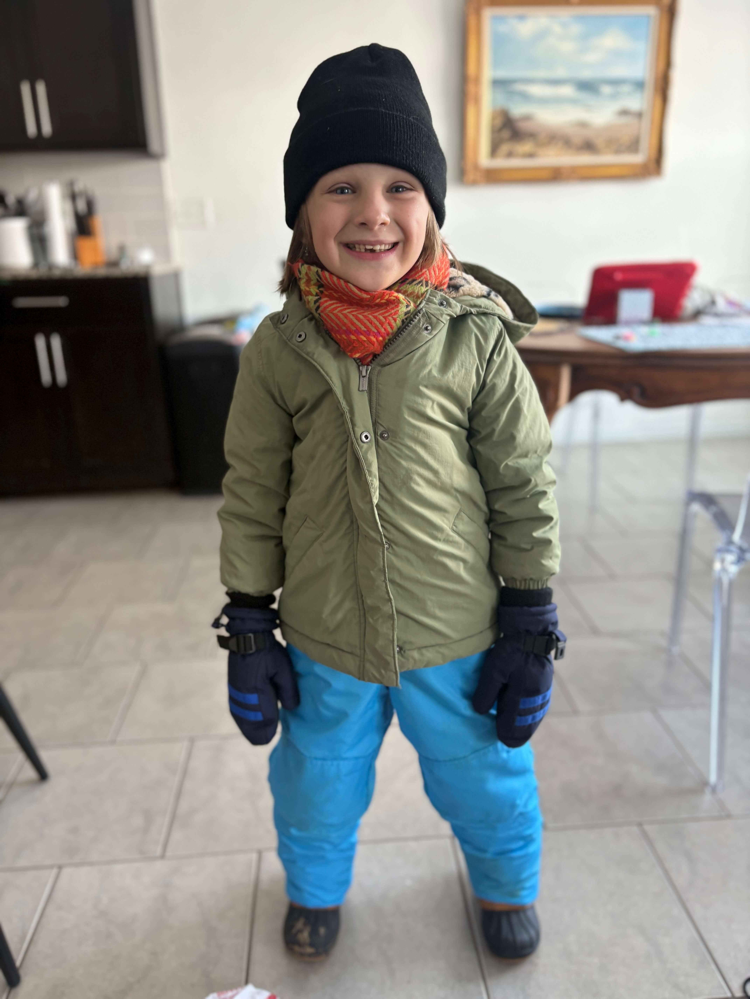
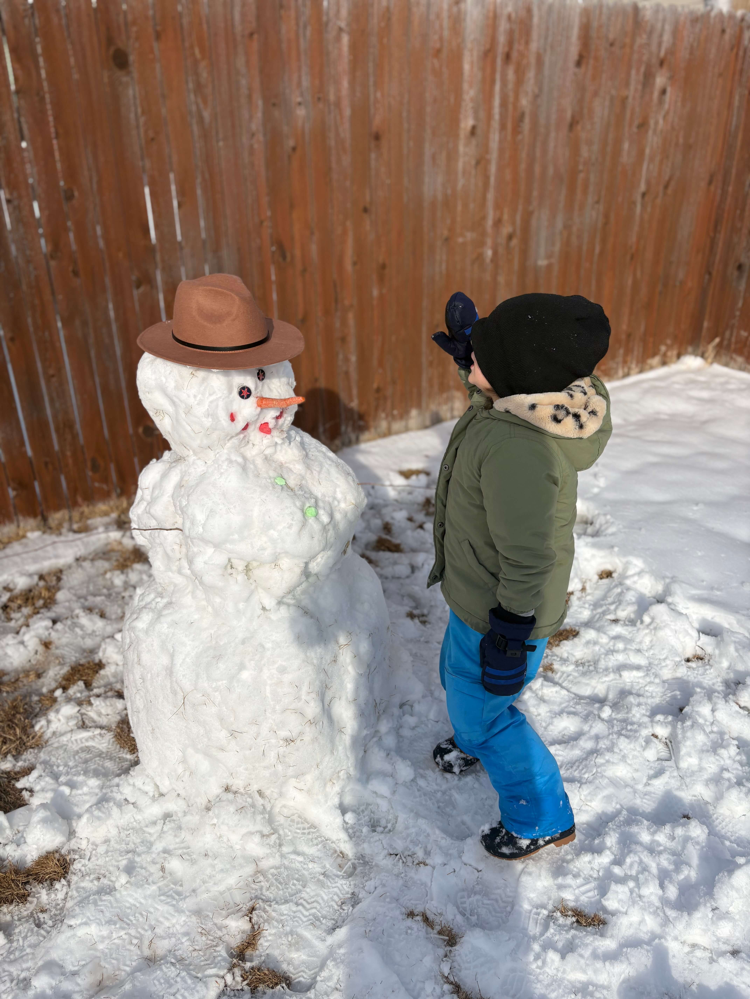
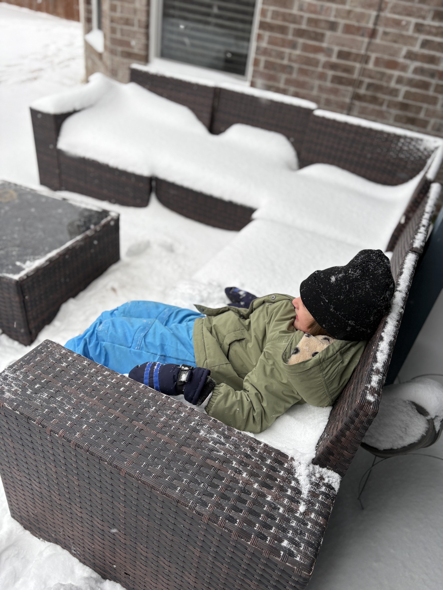
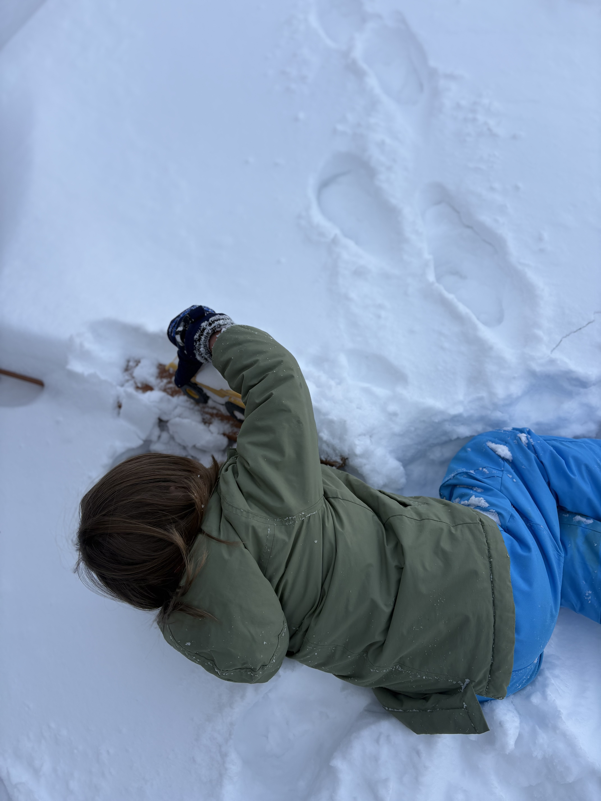
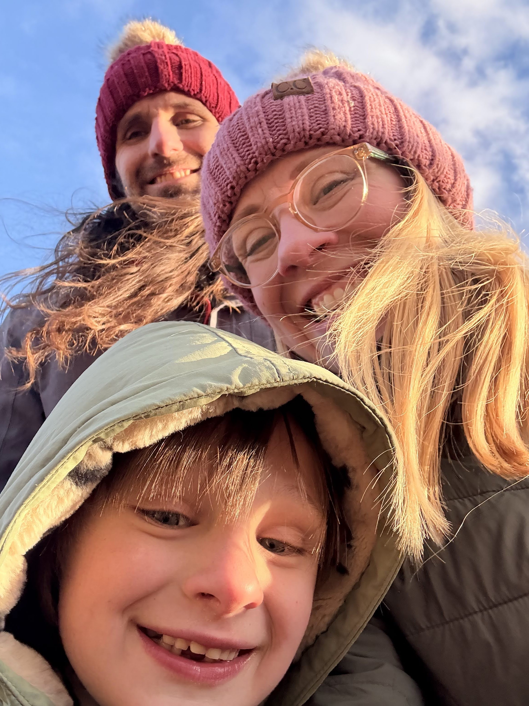
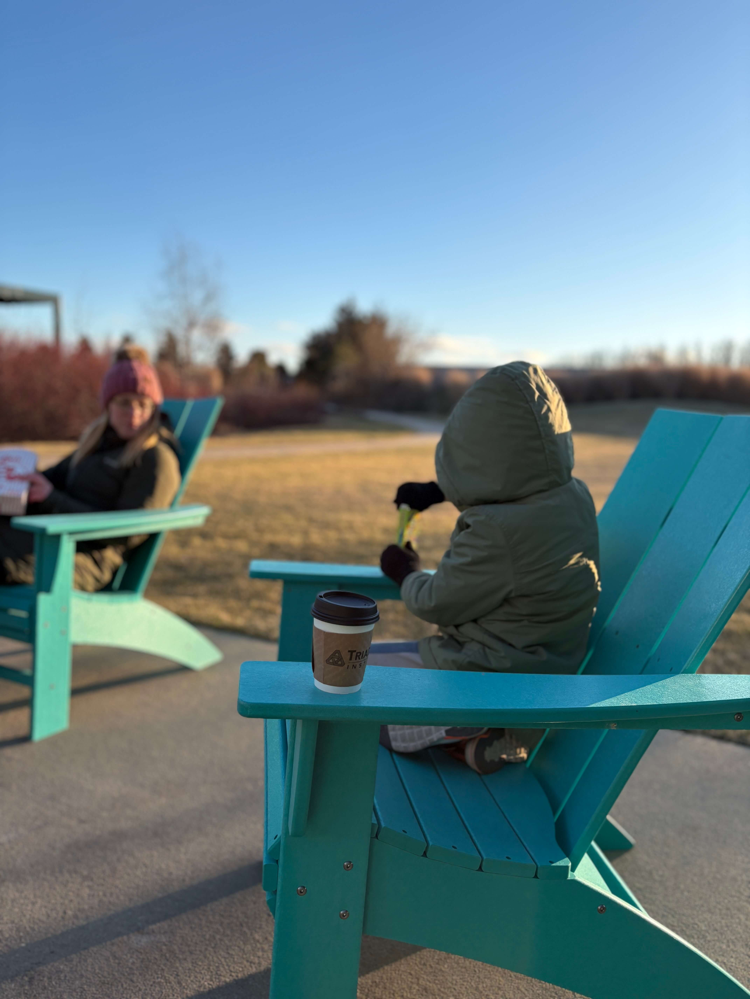
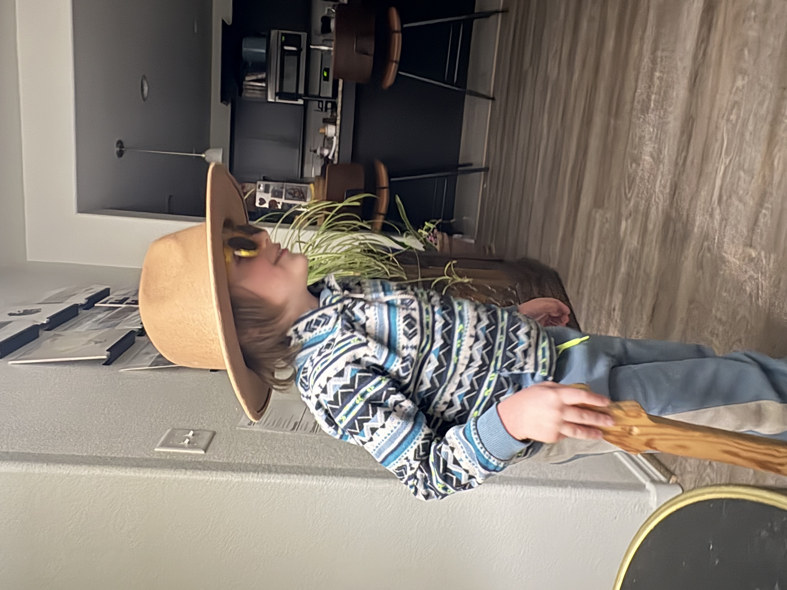
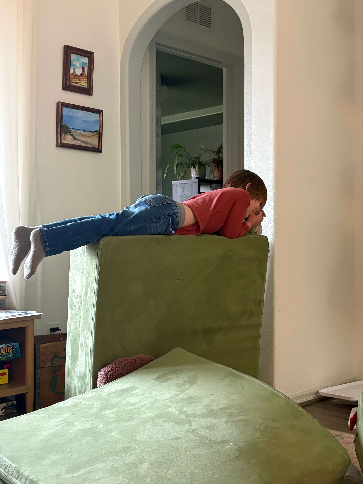

It gets cold in Oklahoma occasionally. When it snows, people freak out, people raid the grocery stores and schools shut down. That lasts about a week and then the snow melts and it warms up and we go back to regular programming.

We did have a pretty decent snowstorm. Calvin was very excited for the snow. He was disappointed that there wasn't any in Utah when they visited for Christmas. 

We went sledding multiple days in a row.

Calvin generally doesn't seem to be bothered too much by the cold and the snow. It does help that he (and Emily) have warm clothes. For some reason, I don't, which is a bit strange given how much time we spent in Rexburg.

Living the dream.

Before it snowed, we went on a tour the new additions to the Botanic Gardens. It was bitterly cold and windy, but we got some hot chocolate and made the best of it.  

Calvin had almost a week of "distance learning", which was just about an hour a day of a teacher somehow wrangling a class that's only present through screens. That seems miraculous to me – and there's a reason I'm not a teacher. Here's Calvin doing head, shoulders, knees and toes. 

We play a lot of Mario Kart around here. We've set a limit so that Calvin can only play 3 sets of races a day. He's getting really good at it. When he first started playing he was just happy to be there. Now he gets competitive and it can get kind of annoying. But we're trying to teach him to lose gracefully.

Calvin has always seemed to have alter egos. Right now, he's in old man mode.

Remember planking?

