## Hurricane

We went on a trip to Hurricane UT which we tend to do twice a year.

Even though the temperature hung around 40 degrees Fahrenheit (or 4 degrees Celcius for those who want to use a system that makes sense), Calvin wanted to hang out in the pool for several hours every day.

The pool cover also makes a good driving surface.

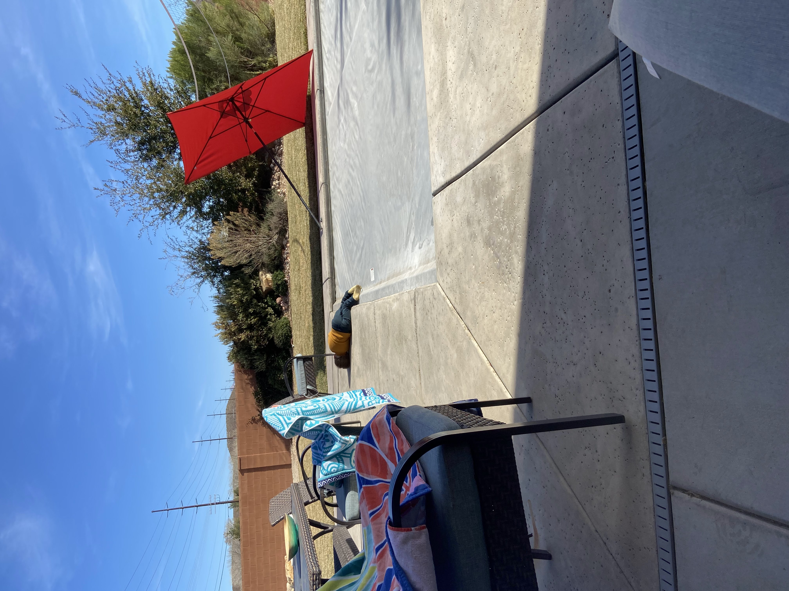

We've introduced Calvin to bowling, which is a great cold-weather activity.

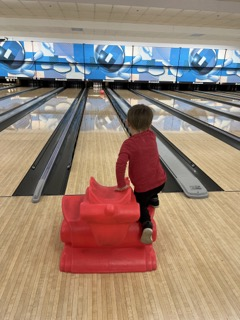

We also got a little mini golf in. Calvin is still a little young for that and he mostly goofed off. He did make an attempt to learn how to hold the golf club. 

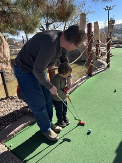

We stayed over the New Years holiday and checked out a local bar, which is not a sin. It was fun and all, but the music was way too loud and we couldn't hear each other, so we peaced out and hung out in the hot tub.

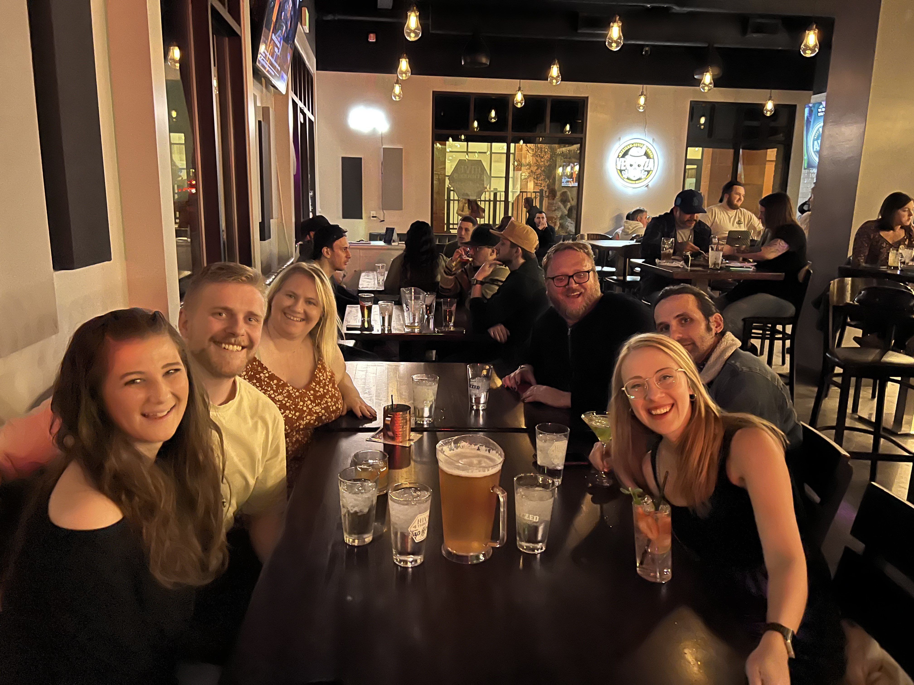

There's a Youtube channel called Matt's Offroad Recovery with a million and a half subscribers that Grandpa Davis introduced to Calvin. It turns out their headquarters is right down the street from the Hurricane house. Of course, a visit was in order.

Calvin was excited to find a "fossil" of a lizard in the backyard.

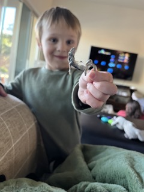

## January Stuff

It finally got cold here and we've been holing up inside and hiding from the occasional snow and ice. We dug the Wii out of storage and have been revisiting games we haven't played in a long time.

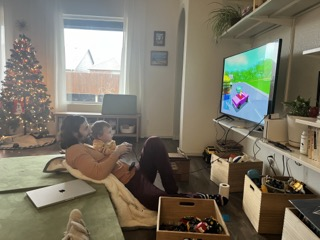

In October Emily wacked her knee helping get our couch out of the van we were borrowing from Janae to deliver it to be reupholstered. He knee has been in bad shape since, and she had to cancel her dance classes and start going to phsyical therapy. The good news is that at long last it seems to be back to normal. The plan is for dance classes to resume in February. I'm going to be taking audio engineering classes at the local college in Tulsa for the next couple of months. 

## Old Stuff

We drove to Arizona in November to have Thanksgiving with the fam. We stopped by Meteor Crater which I had never been to before. It was pretty nifty and they had a lot of cool exhibits that we didn't really have the chance to stop and enjoy fully. But we'll likely come back.

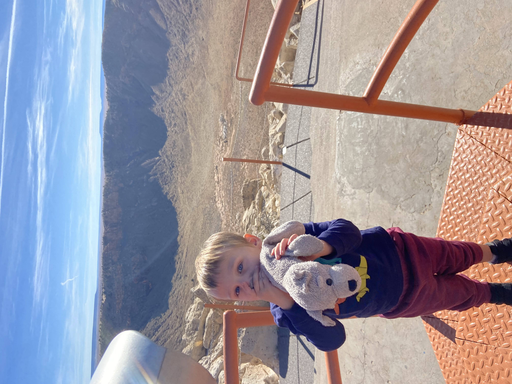

We played a game called Moods where you have to read cards with certain statements like "Is that a pool?" in a certain mood, like "jealous" determined by the roll of the dice. It was utterly hilarious. A glass of wine goes a long way with this game.

Grandpa Coons set up a zipline in their backyard which Calvin and the cousins loved. Also, the pancakes were great as always.

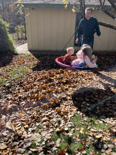
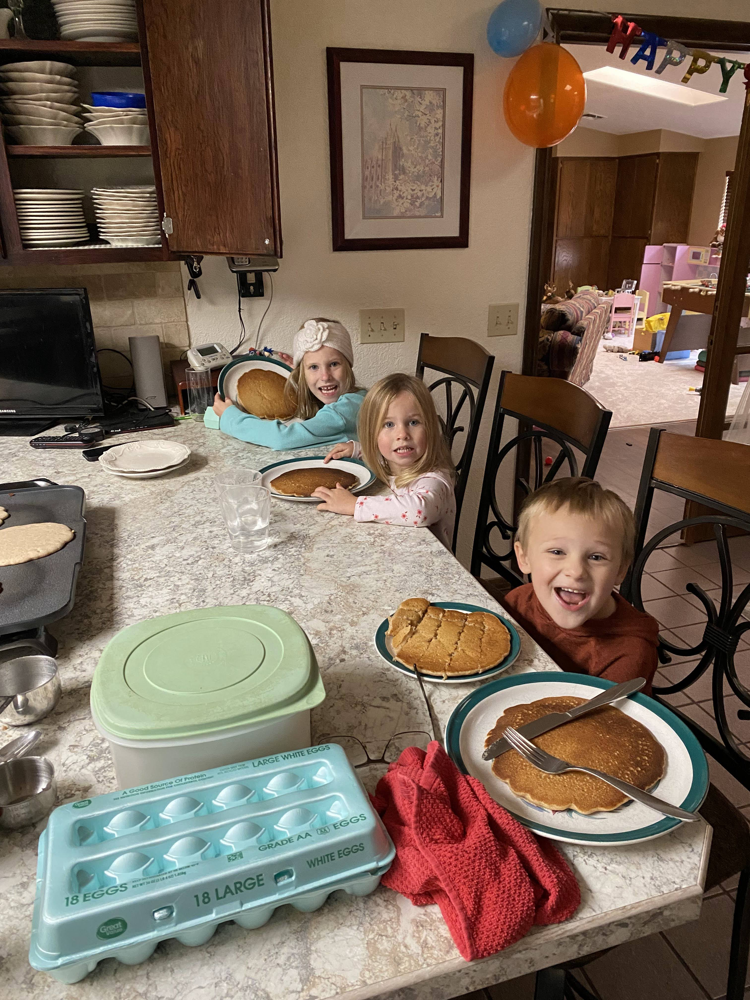

Grandpa Davis and Gran Anne visited Oklahoma and got to spend some quality time with us. We went bowling (remember the thing about it being a good cold weather activity?). We might have eaten out a liiiitle too much, but we wanted to show off the cool local places we had discovered.

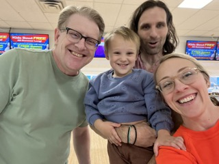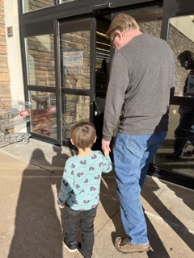 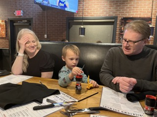 

We celebrated Calvin's 4th birthday and he got some cool new toys.

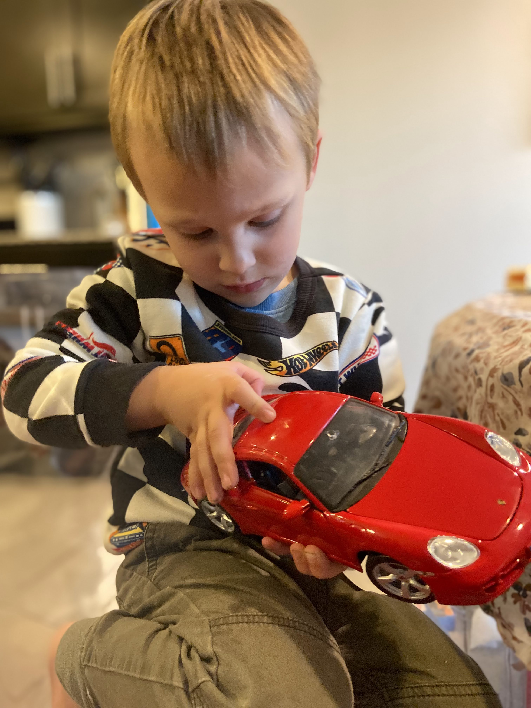

That's all I got and I can't think of a good way to end this so here's a picture of the cousins at a lake.

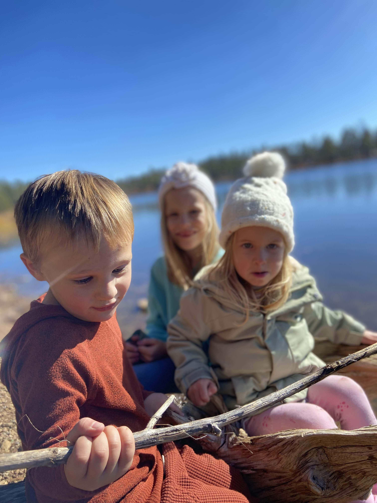
